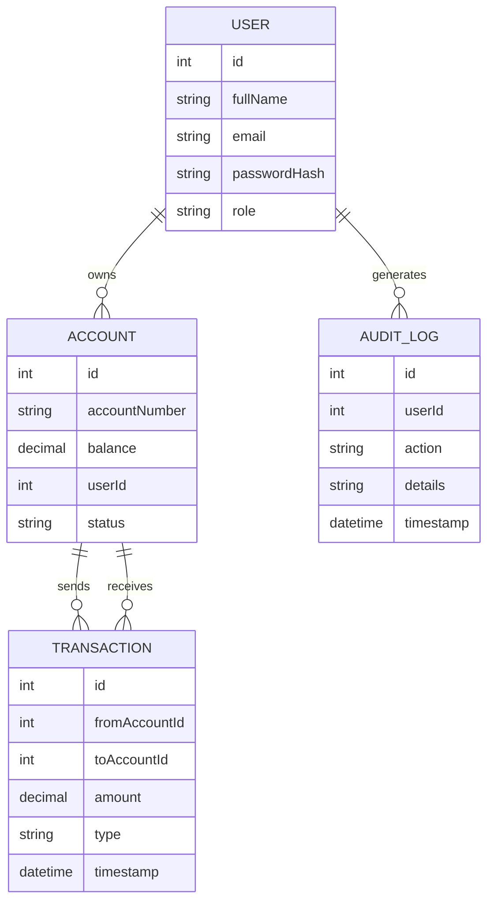

# 🚀 MhlangaFin

## Enterprise Financial Management Platform

<!-- BADGES -->


---

# 📌 Executive Summary

MhlangaFin is an enterprise-grade financial transaction system built using a modern distributed full-stack architecture.

The system consists of:

* 🖥 Backend API – ASP.NET Core
* 🌐 Web Application – Angular
* 📱 Mobile Application – Flutter
* 🗄 Database – SQL Server
* 🚀 Containerized Deployment – Docker + Nginx

Designed for scalability, security, and enterprise readiness.

---

# 🏗 System Architecture

## High-Level Architecture

```text
Client (Web / Mobile)
        │
        ▼
    Nginx Reverse Proxy
        │
        ▼
 ASP.NET Core REST API
        │
        ▼
   SQL Server Database
```

---

# 🔄 System Sequence Diagrams

## 1️⃣ User Login Flow

```text
User → Web/Mobile App → API → Database

1. User enters email & password
2. App sends POST /api/auth/login
3. API validates credentials
4. JWT token generated
5. Token returned to client
6. Client stores token
```

---

## 2️⃣ Money Transfer Flow

```text
User → Client App → API → Database

1. User selects transfer
2. Client sends POST /api/transactions/transfer
3. API validates:
      - Token
      - Account balance
      - Target account
4. Transaction begins (DB Transaction)
5. Debit + Credit executed
6. Transaction committed
7. Confirmation returned
```

---

## 3️⃣ Account Creation Flow

```text
Admin → Web App → API → Database

1. Admin creates account
2. POST /api/accounts
3. API validates role
4. Account saved in DB
5. Response returned
```

---

# 🗄 Database Design (ER Diagram)

## Entity Relationship Diagram



✔ Shows relationships clearly
✔ Enterprise database modeling

---

# 🔐 API Documentation

## Authentication

### 🔑 Login

### Request

```http
POST /api/auth/login
Content-Type: application/json
```

```json
{
  "email": "user@gmail.com",
  "password": "Password123!"
}
```

### Response

```json
{
  "token": "eyJhbGciOiJIUzI1NiIsInR5cCI6IkpXVCJ9...",
  "expiresAt": "2025-01-01T12:00:00"
}
```

---

## 💰 Transfer Money

### Request

```http
POST /api/transactions/transfer
Authorization: Bearer {JWT}
```

```json
{
  "fromAccountId": 1,
  "toAccountId": 2,
  "amount": 500
}
```

### Response

```json
{
  "transactionId": 45,
  "status": "Success",
  "message": "Transfer completed successfully"
}
```

---

## 🏦 Get Account Details

### Request

```http
GET /api/accounts/1
Authorization: Bearer {JWT}
```

### Response

```json
{
  "id": 1,
  "accountNumber": "ACC123456",
  "balance": 2500,
  "status": "Active"
}
```

---

# 🖥 Backend Folder Structure

```text
Backend/
│
├── Controllers/
├── Services/
├── Repositories/
├── Models/
│     ├── Entities/
│     └── DTOs/
├── Data/
├── Middleware/
├── Configuration/
└── Program.cs
```

Enterprise layered architecture.

---

# 📱 Mobile Folder Structure (Flutter)

```text
mobile/
│
├── lib/
│   ├── core/
│   ├── features/
│   │     ├── auth/
│   │     ├── accounts/
│   │     ├── transactions/
│   │
│   ├── services/
│   ├── models/
│   └── main.dart
│
└── pubspec.yaml
```

---

# 🌐 Web Folder Structure (Angular)

```text
web/
│
├── src/
│   ├── app/
│   │    ├── core/
│   │    ├── features/
│   │    ├── shared/
│   │
│   ├── assets/
│   └── environments/
│
└── angular.json
```

---

# 🚀 Production Deployment Guide

## ✅ Production Architecture

```text
            Internet
               │
               ▼
            Nginx
               │
     -------------------------
     │                       │
Flutter App            Angular App
     │                       │
     └───────────┬───────────┘
                 ▼
        ASP.NET Core API
                 │
                 ▼
            SQL Server
```

---

# 🐳 Docker Deployment (Enterprise Ready)

## Dockerfile – Backend

```dockerfile
FROM mcr.microsoft.com/dotnet/aspnet:8.0
WORKDIR /app
COPY . .
ENTRYPOINT ["dotnet", "Backend.dll"]
```

---

## docker-compose.yml

```yaml
version: "3.9"

services:

  api:
    build: ./backend
    container_name: mhlangafin_api
    ports:
      - "5000:80"
    depends_on:
      - db
    environment:
      - ConnectionStrings__DefaultConnection=Server=db;Database=MhlangaFin;User=sa;Password=YourStrong@123;

  db:
    image: mcr.microsoft.com/mssql/server:2022-latest
    container_name: mhlangafin_db
    environment:
      SA_PASSWORD: "YourStrong@123"
      ACCEPT_EULA: "Y"
    ports:
      - "1433:1433"

  nginx:
    image: nginx:latest
    container_name: mhlangafin_nginx
    ports:
      - "80:80"
    volumes:
      - ./nginx.conf:/etc/nginx/nginx.conf
    depends_on:
      - api
```

---

## Nginx Configuration

`nginx.conf`

```nginx
events {}

http {

  server {
    listen 80;

    location /api/ {
        proxy_pass http://api:80/;
        proxy_http_version 1.1;
        proxy_set_header Upgrade $http_upgrade;
        proxy_set_header Connection keep-alive;
    }
  }
}
```

---

## 🚀 Run Production Environment

```bash
docker-compose up --build -d
```

Check containers:

```bash
docker ps
```


# 👨🏽‍💻 Author

**Mbongeni Mhlanga**
Full Stack Engineer | Enterprise Systems | FinTech Architecture


